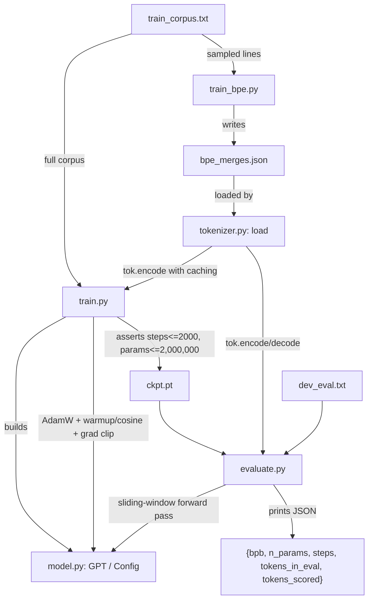

# 2,000-Step LLM Speedrun

**A from-scratch GPT-style language model trained under a hard 2,000-step / 2,000,000-parameter budget, optimized for bits-per-byte on mixed English–Hindi text.**


> Repository root observed: `D:\speedrun` (contains `LLM_assignment.pdf`, `llm_handout.zip`, and the working tree under `llm_handout/`). This README documents `llm_handout/starter/`, which is the actual code and submission-in-progress.

---

## Table of Contents

1. [Project Overview](#project-overview)
2. [Problem Statement](#problem-statement)
3. [Solution](#solution)
4. [Key Features](#key-features)
5. [Technology Stack](#technology-stack)
6. [Architecture Overview](#architecture-overview)
7. [Architecture Diagram](#architecture-diagram)
8. [End-to-End Flow](#end-to-end-flow)
9. [Folder Structure](#folder-structure)
10. [Component Breakdown](#component-breakdown)
11. [Setup Instructions](#setup-instructions)
12. [Environment Variables](#environment-variables)
13. [API Documentation](#api-documentation)
14. [Database Design](#database-design)
15. [AI / Agent Architecture](#ai--agent-architecture)
16. [Engineering Decisions](#engineering-decisions)
17. [Performance Considerations](#performance-considerations)
18. [Security Considerations](#security-considerations)
19. [Known Limitations](#known-limitations)
20. [Future Improvements](#future-improvements)
21. [Screenshots](#screenshots)
22. [Contributing](#contributing)
23. [License](#license)

---

## Project Overview

This repository implements a small GPT-style causal language model, trained entirely from scratch (no pretrained weights of any kind), on a fixed corpus of mixed English and Hindi (Devanagari) text. Training and evaluation are governed by hard, code-enforced caps: a maximum of 2,000 optimizer steps and 2,000,000 total parameters, CPU only. The objective, per `../../LLM_assignment.pdf`, is to minimize **bits-per-byte (bpb)** on held-out text under those constraints.

This is not a web application, API service, or product — it is a constrained ML training/evaluation exercise (an "LLM speedrun") with a defined submission format: modified training/model/tokenizer code, a final checkpoint, and written run logs.

## Problem Statement

The starter code ships a deliberately mediocre baseline trainer (`train.py` as originally provided) with several documented weaknesses, discovered by inspection and confirmed empirically in `RUNLOG.md`:

- Constant learning rate with no warmup or decay schedule.
- No weight decay and no gradient clipping.
- `tie_weights = False`, spending parameters on a redundant output projection under a tight parameter cap.
- Flat `std=0.05` initialization applied uniformly, including residual-stream projections, allowing activation variance to grow with depth.
- A raw byte-level tokenizer (vocab 256), which encodes each Devanagari character as 2–3 UTF-8 bytes — inflating effective sequence length specifically on the Hindi portion of the corpus and wasting context window and step budget.

Since only 2,000 optimizer steps and 2,000,000 parameters are permitted, and only the provided corpus may be used, "train longer" or "make it bigger" are not available levers — the problem is to extract more model quality from the *same* fixed budget.

## Solution

The repository addresses this by modifying the training recipe, tokenizer, and model architecture, then validating each change with isolated, logged ablation experiments before committing to a final full-budget training run.

Core workflow, as implemented in the code:

1. Train a byte-level BPE tokenizer on the provided corpus only (`train_bpe.py`), producing `bpe_merges.json`.
2. Train the model (`train.py`) with a configurable architecture and recipe (AdamW, warmup+cosine schedule, weight decay, gradient clipping, optional weight tying, optional RoPE), subject to the hard step/parameter caps enforced in code.
3. Score the resulting checkpoint with the unmodified `evaluate.py`, which computes bits-per-byte over a sliding-window pass with 50% context carry-over.
4. Log every run's hypothesis, change, and result in `RUNLOG.md`.

## Key Features

| Feature | Description |
| ------- | ----------- |
| Configurable GPT model | `model.py`'s `Config` class parameterizes layer count, head count, embedding width, block size, dropout, weight tying, positional encoding, and init std — all changeable without editing model code. |
| Byte-level BPE tokenizer | `train_bpe.py` trains merges on the provided corpus only; `tokenizer.py`'s `BPETokenizer` applies them with a guaranteed lossless byte fallback. |
| Rotary positional encoding (RoPE) | Implemented in `model.py` (`rotate_half`, `apply_rope`) as an alternative to learned absolute position embeddings, selectable via `Config.pos_encoding`. |
| Weight tying | `Config.tie_weights` shares the output head's weight matrix with the token embedding (`self.head.weight = self.tok_emb.weight`). |
| GPT-2-style initialization | `model.py`'s `GPT.__init__` scales residual-stream projection weights (`*.proj.weight`, `mlp.2.weight`) by `1/sqrt(2*n_layer)` on top of the base `init_std`. |
| Configurable training recipe | `train.py` implements AdamW with decoupled weight decay (applied only to 2D+ weight matrices, not biases/LayerNorm), linear warmup + cosine LR decay, and gradient-norm clipping, all controllable via CLI flags. |
| Tokenization caching | `train.py`'s `load_ids_cached` hashes `(data_path, vocab_size, len(text))` and caches the encoded token tensor under `.tok_cache/`, avoiding re-encoding the corpus on repeated ablation runs. |
| Hard-cap enforcement | `train.py` asserts `steps <= 2000` and `n_params <= 2_000_000` before saving a checkpoint; violating either raises immediately. |
| Official bits-per-byte scorer | `evaluate.py` (unmodified from the handout) computes bpb via a sliding window with 50% context carry-over and verifies tokenizer losslessness before scoring. |
| Ablation automation scripts | `ablate.sh` and `ablate2.sh` run and score multiple configurations in sequence, appending JSON-line results to `results.jsonl` / `results2.jsonl`. |

## Technology Stack

**Languages**


**Frameworks / Libraries**


- `torch` / `torch.nn` / `torch.nn.functional` — model definition, training loop, `F.scaled_dot_product_attention`, `AdamW` optimizer, checkpoint save/load (`model.py`, `train.py`, `evaluate.py`).
- `numpy` — vectorized byte-pair counting and merging in `train_bpe.py` only; not used in the model or training loop itself.
- Python standard library — `argparse`, `json`, `math`, `time`, `hashlib`, `os`, `heapq`, `random` (`train.py`, `tokenizer.py`, `train_bpe.py`, `evaluate.py`).

**Databases:** Not found in repository.

**AI/ML:** A custom decoder-only Transformer ("small GPT") implemented directly in PyTorch — see [Architecture Overview](#architecture-overview). No pretrained weights, no third-party model libraries (e.g. `transformers`), per the assignment's hard constraints, and none are present in the code.

**Infrastructure:** None found. No Dockerfile, no CI/CD configuration, no deployment configuration, and no cloud/hosting references exist in the repository. Training and evaluation both run as local CLI scripts on CPU only.

**Dev Tools:** A Python virtual environment (`env/`) is referenced by `ablate.sh` / `ablate2.sh` (`source ~/speedrun/env/bin/activate`) but its contents are excluded from version control via `.gitignore`.

## Architecture Overview

The system has four functional components, all plain Python modules invoked via CLI, with no networked services:

- **Tokenizer layer** (`tokenizer.py`, `train_bpe.py`): converts raw UTF-8 text to/from integer token IDs. Two implementations share one interface (`load()` → object with `.encode()`, `.decode()`, `.vocab_size`): a byte-level fallback (`ByteTokenizer`) and a trained byte-level BPE tokenizer (`BPETokenizer`), selected automatically based on whether `bpe_merges.json` exists next to `tokenizer.py`.
- **Model layer** (`model.py`): a decoder-only Transformer (`GPT`) composed of a token embedding, optional learned positional embedding or RoPE, a stack of pre-norm `Block` modules (causal self-attention + GELU MLP with residual connections), a final LayerNorm, and a linear output head (optionally weight-tied to the token embedding).
- **Training driver** (`train.py`): loads/encodes the corpus (with caching), builds the model from a `Config` (overridable via CLI flags), runs the AdamW + warmup/cosine training loop with gradient clipping, enforces the step/parameter caps, and saves a checkpoint (`ckpt.pt`) containing model weights, the full config, step count, and the training loss curve.
- **Evaluation driver** (`evaluate.py`, unmodified from the handout): loads a checkpoint, rebuilds the exact model from its saved config, and computes bits-per-byte on a given text file via a sliding-window forward pass, verifying the tokenizer's lossless round-trip before scoring.

Two shell scripts (`ablate.sh`, `ablate2.sh`) orchestrate multiple train→evaluate cycles for comparative experiments, writing results to JSON-lines files.

## Architecture Diagram



## End-to-End Flow

```mermaid
sequenceDiagram
    participant U as User (CLI)
    participant TB as train_bpe.py
    participant TOK as tokenizer.py
    participant TR as train.py
    participant M as model.py (GPT)
    participant EV as evaluate.py
    participant FS as Filesystem

    U->>TB: python train_bpe.py --data train_corpus.txt
    TB->>FS: read train_corpus.txt (sampled lines)
    TB->>FS: write bpe_merges.json
    U->>TR: python train.py --data train_corpus.txt --steps 2000 ...
    TR->>FS: read train_corpus.txt
    TR->>TOK: load()
    TOK->>FS: check for bpe_merges.json
    TOK-->>TR: tokenizer instance (BPE or byte)
    TR->>TOK: encode(text) [cached in .tok_cache/]
    TR->>M: GPT(cfg)
    loop up to 2000 steps
        TR->>M: forward(batch) -> logits, loss
        M-->>TR: loss
        TR->>TR: AdamW.step() + grad clip + LR schedule
    end
    TR->>FS: save ckpt.pt (weights, config, steps, loss curve)
    U->>EV: python evaluate.py --checkpoint ckpt.pt --text_file dev_eval.txt
    EV->>FS: load ckpt.pt
    EV->>M: rebuild GPT from saved config
    EV->>TOK: load(); encode(text); verify decode(encode(text)) == text
    EV->>M: forward pass over sliding windows
    EV-->>U: print JSON {bpb, n_params, steps, ...}
```

## Folder Structure

```text
D:\speedrun/
├── LLM_assignment.pdf          # Assignment brief (rules, caps, deliverables)
├── llm_handout.zip             # Original handout archive
├── .gitignore
└── llm_handout/
    ├── data/
    │   ├── train_corpus.txt    # ~7.3 MB mixed English + Hindi corpus (only allowed training data)
    │   └── dev_eval.txt        # Held-out text for self-scoring during development
    └── starter/
        ├── README.md           # This file
        ├── RUNLOG.md           # Run-by-run experiment log (graded deliverable)
        ├── model.py            # GPT model definition (Config, SelfAttention, Block, GPT)
        ├── tokenizer.py        # ByteTokenizer / BPETokenizer, load()
        ├── train_bpe.py        # BPE merge-table trainer
        ├── train.py            # Training loop / CLI
        ├── evaluate.py         # Official bits-per-byte scorer (unmodified interface)
        ├── _check_tokenizer.py # Manual round-trip / compression-ratio check script
        ├── ablate.sh           # First ablation sweep (Runs 1–5)
        └── ablate2.sh          # Second ablation sweep (Runs 6–12)
```

Not present in the observed repository as of this audit: `ckpt.pt`, `NOTES.md`, `SUMMARY.html`, `bpe_merges.json` (produced at runtime by `train_bpe.py`, not committed at time of writing), `results.jsonl`, `results2.jsonl`, `runs/` (produced at runtime by the ablation scripts).

## Component Breakdown

### `model.py`
- **Purpose:** Defines the GPT architecture and its configuration surface.
- **Inputs:** A `Config` instance; at forward time, a batch of token ID tensors (`idx`) and optional `targets`.
- **Outputs:** `(logits, loss)` from `forward()`; parameter count from `n_params()`.
- **Dependencies:** `torch`, `torch.nn`, `torch.nn.functional`, `math`.

### `tokenizer.py`
- **Purpose:** Provides a single `load()` entry point returning either `ByteTokenizer` or `BPETokenizer`, both exposing `.encode(str) -> list[int]`, `.decode(list[int]) -> str`, `.vocab_size`.
- **Inputs:** Raw UTF-8 text (`encode`) or a list of token IDs (`decode`); `BPETokenizer` additionally reads `bpe_merges.json` from disk if present.
- **Outputs:** Token ID lists / decoded text strings, guaranteed lossless round-trip.
- **Dependencies:** `heapq`, `json`, `os` (standard library only).

### `train_bpe.py`
- **Purpose:** Learns a byte-level BPE merge table from a random line-sample of `train_corpus.txt`.
- **Inputs:** `--data` (corpus path), `--vocab_size` (default 2048), `--sample_bytes` (default 2,000,000), `--seed`.
- **Outputs:** `bpe_merges.json` containing the ordered merge list and resulting vocab size.
- **Dependencies:** `numpy`, `argparse`, `json`, `random`, `time`.

### `train.py`
- **Purpose:** Runs the full training loop under the hard caps and saves a checkpoint.
- **Inputs:** `--data`, `--steps`, `--batch`, `--lr`, `--min_lr`, `--warmup_steps`, `--weight_decay`, `--grad_clip`, `--seed`, `--out`, `--log_every`, plus optional architecture overrides (`--block_size`, `--n_embd`, `--n_layer`, `--n_head`, `--dropout`, `--tie_weights`/`--no_tie_weights`, `--pos_encoding`, `--init_std`).
- **Outputs:** `ckpt.pt` (or the path given via `--out`) containing `model` state dict, full `config`, `steps`, and `train_loss_curve`.
- **Dependencies:** `torch`, `model.py`, `tokenizer.py`, `argparse`, `hashlib`, `math`, `os`, `time`.

### `evaluate.py`
- **Purpose:** The official, unmodified scoring script — computes bits-per-byte for a given checkpoint and text file.
- **Inputs:** `--checkpoint` (default `ckpt.pt`), `--text_file` (required).
- **Outputs:** One JSON line to stdout: `{"bpb": ..., "n_params": ..., "steps": ..., "tokens_in_eval": ..., "tokens_scored": ...}`.
- **Dependencies:** `torch`, `model.py`, `tokenizer.py`, `argparse`, `json`, `math`.

### `_check_tokenizer.py`
- **Purpose:** Manual verification script — checks lossless round-trip and reports byte-to-token compression ratio on `data/dev_eval.txt`, `data/train_corpus.txt`, and an ad hoc mixed-content string.
- **Inputs:** None (paths are hardcoded relative to the script's working directory).
- **Outputs:** Printed round-trip status and compression ratios; exits non-zero on failure.
- **Dependencies:** `tokenizer.py`, `sys`.

### `ablate.sh` / `ablate2.sh`
- **Purpose:** Orchestrate a sequence of `train.py` → `evaluate.py` runs with varying arguments, for comparative experiments.
- **Inputs:** Hardcoded run definitions (name, step count, CLI overrides) within each script.
- **Outputs:** Per-run logs under `runs/`, and one JSON line per run appended to `results.jsonl` (`ablate.sh`) or `results2.jsonl` (`ablate2.sh`).
- **Dependencies:** `train.py`, `evaluate.py`, a Bash shell, an activated Python virtual environment.

## Setup Instructions

### Prerequisites
- Python 3 (version not pinned in any repository file — a `.dist-info` for Python 3.12 was observed in the local virtual environment, but this is environment-specific, not a repository requirement).
- PyTorch (CPU build) and NumPy. No `requirements.txt`, `pyproject.toml`, or `setup.py` was found in the repository — dependencies are inferred solely from `import` statements in the source files.

### Clone Repository
```bash
git clone https://github.com/ishwaryaaaaaaaaa/plivo-ml-24MT10049.git
cd plivo-ml-24MT10049
```
(Remote URL confirmed via `git remote -v` in this working tree.)

### Create Virtual Environment
```bash
python3 -m venv env
source env/bin/activate       # Linux/macOS/WSL
# or: env\Scripts\activate    # Windows PowerShell
```

### Install Dependencies
No dependency manifest exists in the repository. Based on the imports actually present in the code:
```bash
pip install torch --index-url https://download.pytorch.org/whl/cpu
pip install numpy
```

### Configure Environment Variables
Not found in repository — see [Environment Variables](#environment-variables).

### Run Application

From `llm_handout/starter/`:

```bash
# (Optional) train the BPE tokenizer on the corpus
python train_bpe.py --data ../data/train_corpus.txt --out bpe_merges.json

# Train the model
python train.py --data ../data/train_corpus.txt --steps 2000 --out ckpt.pt

# Evaluate the resulting checkpoint
python evaluate.py --checkpoint ckpt.pt --text_file ../data/dev_eval.txt
```

### Development Mode
Ablation/experiment scripts, run from `llm_handout/starter/`:
```bash
bash ablate.sh
bash ablate2.sh
```
Both scripts attempt `source ~/speedrun/env/bin/activate` before running, and expect a `data/` directory relative to the script's own location (i.e., they are written to be run with `starter/` as the working directory and a `data/` symlink or copy alongside it — the scripts' `cd "$(dirname "$0")"` sets cwd to `starter/`, and they reference `data/train_corpus.txt`, not `../data/train_corpus.txt`; this relative path should be verified against the actual working-directory layout before running).

### Production Mode
Not found in repository. There is no packaging, deployment, or "production" configuration — the deliverable is a submission folder (code + checkpoint + logs), not a deployed service.

## Environment Variables

No `.env`, `.env.example`, or environment-variable references were found anywhere in the source code. All configuration is passed via command-line arguments (see `train.py`'s `argparse` definitions) or the `Config` class defaults in `model.py`.

| Variable | Required | Description |
| -------- | -------- | ----------- |
| — | — | Not found in repository. |

## API Documentation

Not applicable. This repository exposes no HTTP/network API — all interaction is via command-line scripts (`train.py`, `train_bpe.py`, `evaluate.py`).

## Database Design

Not found in repository. No database, ORM, schema, or persistent storage beyond flat files (`ckpt.pt` checkpoints, `bpe_merges.json`, `.tok_cache/*.pt`, `results*.jsonl`) is present.

## AI / Agent Architecture

This repository does not use CrewAI, LangGraph, an LLM API (OpenAI, Llama, etc.), a multi-agent framework, or a RAG system. The "AI" component is the GPT model trained by this codebase itself — see [Architecture Overview](#architecture-overview) and [Component Breakdown](#component-breakdown) for its structure. There is no external model API call anywhere in the source.

## Engineering Decisions

Sourced directly from `RUNLOG.md`'s "Run 0" through "Runs 6–12" entries, code comments in `train.py`/`model.py`/`tokenizer.py`, and the ablation scripts.

### Initial Design
The provided starter (`train.py`/`model.py`/`tokenizer.py` as originally handed out) used: a constant learning rate with no warmup or decay, no weight decay, no gradient clipping, untied output/embedding weights, a flat `N(0, 0.05)` initialization applied uniformly to all `Linear`/`Embedding` weights, learned absolute positional embeddings, and a raw byte-level tokenizer (vocab 256). `RUNLOG.md` Run 0 records this baseline's result: dev bpb = 2.3718, 1,339,840 parameters, over the full 2,000-step budget.

### Problems Encountered
`RUNLOG.md` and code comments document a specific, concrete failure during tokenizer development: an initial BPE encoding implementation re-scanned the entire token sequence for every merge (O(n × merges) complexity), which was fast enough on short strings but effectively hung when run against the full ~7.3 MB corpus during a round-trip verification test (per the "Rewrote the tokenizer's encode path" note and the docstring in `tokenizer.py`'s `_bpe_ids` method, which explicitly states: "the naive one is O(n * num_merges) and is far too slow on a multi-megabyte corpus").

### Architectural Limitations
The parameter and step caps (2,000,000 params / 2,000 steps, enforced by `assert` statements in `train.py`) constrain both model capacity and training duration simultaneously, which `RUNLOG.md` notes rules out simply scaling up the model or training longer as an improvement strategy.

### Improvements Made
Per `RUNLOG.md`'s ablation tables (Runs 1–12):
- Replacing the naive BPE encoder with a doubly-linked-list + min-heap merge algorithm (documented in `tokenizer.py`'s `_bpe_ids` docstring as O(n log n)) resolved the hang and made full-corpus BPE encoding practical.
- A combined "recipe fix" (AdamW with decoupled weight decay, linear warmup + cosine decay, gradient-norm clipping, weight tying, GPT-2-style init) reduced dev bpb from 2.9294 to 2.4059 in an isolated 500-step comparison (Run 1 → Run 2 in `RUNLOG.md`).
- Switching from the byte tokenizer to BPE, with the training recipe held constant, reduced dev bpb from 2.9294 to 2.3782 (Run 1 → Run 3).
- Switching from learned absolute positional embeddings to RoPE, with tokenizer and recipe held constant, reduced dev bpb from 2.2373 to 1.8770 (Run 4 → Run 5) — `RUNLOG.md` attributes this to RoPE requiring no learned parameters, versus a learned position-embedding table.
- A subsequent sweep of block size and batch size (Runs 6–12) found block_size=320 and batch=32 to be the best-performing combination tested (dev bpb 1.8124 at 500 steps), and a learning-rate sweep found the existing default of 3e-3 was already near-optimal.

### Final Design
Per `RUNLOG.md`'s Run 12 conclusion, the locked-in final configuration is: BPE tokenizer (vocab 2048), the full training-recipe fix (AdamW, weight decay 0.1, gradient clip 1.0, linear warmup + cosine decay, tied weights, GPT-2-style init), RoPE positional encoding, block_size=320, batch=32, lr=3e-3, to be trained for the full 2,000-step budget.

### Lessons Learned
`RUNLOG.md` explicitly draws these conclusions from its own data: (1) the tokenizer swap and the training-recipe fix produced similarly large, largely independent/additive improvements (~18-19% relative bpb reduction each in isolation); (2) RoPE outperformed learned positional embeddings specifically in a low-step-budget regime, reasoned in `RUNLOG.md` as being because RoPE has nothing to learn positionally, freeing the step budget for content modeling; (3) since only optimizer steps (not wall-clock time or token count) are capped, increasing tokens-per-step via larger block size/batch size was a legitimate and effective way to spend the fixed step budget, at the cost of per-step wall-clock time.

## Performance Considerations

- **Tokenization caching:** `train.py`'s `load_ids_cached` avoids re-encoding the full corpus on every run by caching the resulting token ID tensor to `.tok_cache/`, keyed by an MD5 hash of the data path, tokenizer vocab size, and text length.
- **Vectorized BPE training:** `train_bpe.py` uses NumPy array operations (`np.unique`, boolean masking) for pair counting and merging, rather than pure-Python loops, to make training ~1,800 merges tractable in minutes rather than hours (per its module docstring).
- **O(n log n) BPE encoding:** `tokenizer.py`'s `BPETokenizer._bpe_ids` uses a linked-list-plus-min-heap algorithm instead of a naive rescan-per-merge approach, explicitly to make encoding the full multi-megabyte corpus practical (see [Engineering Decisions](#engineering-decisions)).
- **Batch/block-size tuning:** `RUNLOG.md` documents that increasing `block_size` and `batch` (within the fixed 2,000-step cap) was used deliberately to trade increased per-step wall-clock time for more tokens processed per optimizer step, since only step count — not compute time — is capped.
- Caching, concurrency, and scalability beyond the above: Not found in repository. Training runs single-process on CPU; no multiprocessing, threading, or distributed training code is present.

## Security Considerations

Not applicable / not found in repository. This is a local, offline training/evaluation script with no network interface, no authentication, no authorization, and no secret handling. `torch.load(..., weights_only=True)` is used in both `train.py`'s cache loader and `evaluate.py`'s checkpoint loader, which restricts unpickling to tensor data only — the only security-relevant code observed.

## Known Limitations

- As of this audit, no final full-budget (2,000-step) training run has produced a `ckpt.pt` in the repository — the current state reflects completed ablation experiments (at reduced step counts) but not yet a final submission checkpoint.
- `NOTES.md` and `SUMMARY.html`, both required deliverables per `../../LLM_assignment.pdf`, are not present in the repository as of this audit.
- `bpe_merges.json` (required for the `BPETokenizer` path to be used by `train.py`/`evaluate.py` at all) is not present in the repository as of this audit — it is a runtime-generated artifact of `train_bpe.py`.
- `ablate.sh`/`ablate2.sh` reference `data/train_corpus.txt` as a relative path after `cd`-ing into the script's own directory (`starter/`), whereas the actual data files observed in this repository live at `../data/train_corpus.txt` relative to `starter/` — this path assumption should be verified/fixed before relying on these scripts as written.
- No automated tests (e.g. `pytest` suite) were found; `_check_tokenizer.py` is a standalone manual verification script, not part of an automated test framework.
- No `requirements.txt`/`pyproject.toml` pins dependency versions; reproducibility across environments is not guaranteed by the repository as it stands.

## Future Improvements

Not found in repository. No TODO comments, roadmap file, or planned-feature notes were found in any source file, `RUNLOG.md`, or script. The only stated remaining actions come from the current state of the deliverables checklist (final training run, `NOTES.md`, `SUMMARY.html`) rather than a documented roadmap.

## Screenshots

Not found in repository. No image assets or screenshot references exist in the source tree.

## Contributing

No `CONTRIBUTING.md` or contribution guidelines file was found in the repository. This repository is an individual assignment submission (per `../../LLM_assignment.pdf`'s rules on AI-assisted tooling and grading), not an open-for-contribution project; general good practice for anyone extending it:

1. Log every training run in `RUNLOG.md` with hypothesis, change, before/after dev bpb, and conclusion — this is a graded requirement of the parent assignment.
2. Do not modify `evaluate.py`'s CLI interface (`--checkpoint`, `--text_file`, JSON output shape) — the assignment requires it to keep working unmodified.
3. Verify tokenizer losslessness (`decode(encode(text)) == text`) on the full corpus and on arbitrary/adversarial UTF-8 input after any tokenizer change, using `_check_tokenizer.py` as a starting point.
4. Confirm `n_params <= 2,000,000` and `steps <= 2,000` before treating a run as a valid submission candidate (both are asserted in `train.py`, but should be double-checked against the printed values).

## License

License file not found in repository.
