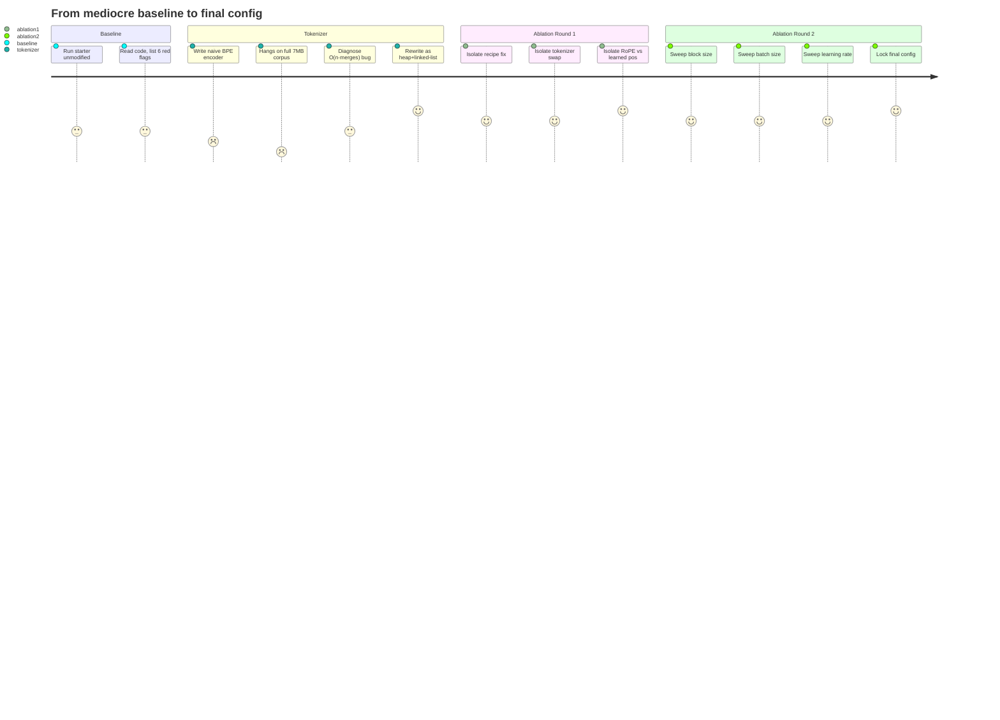
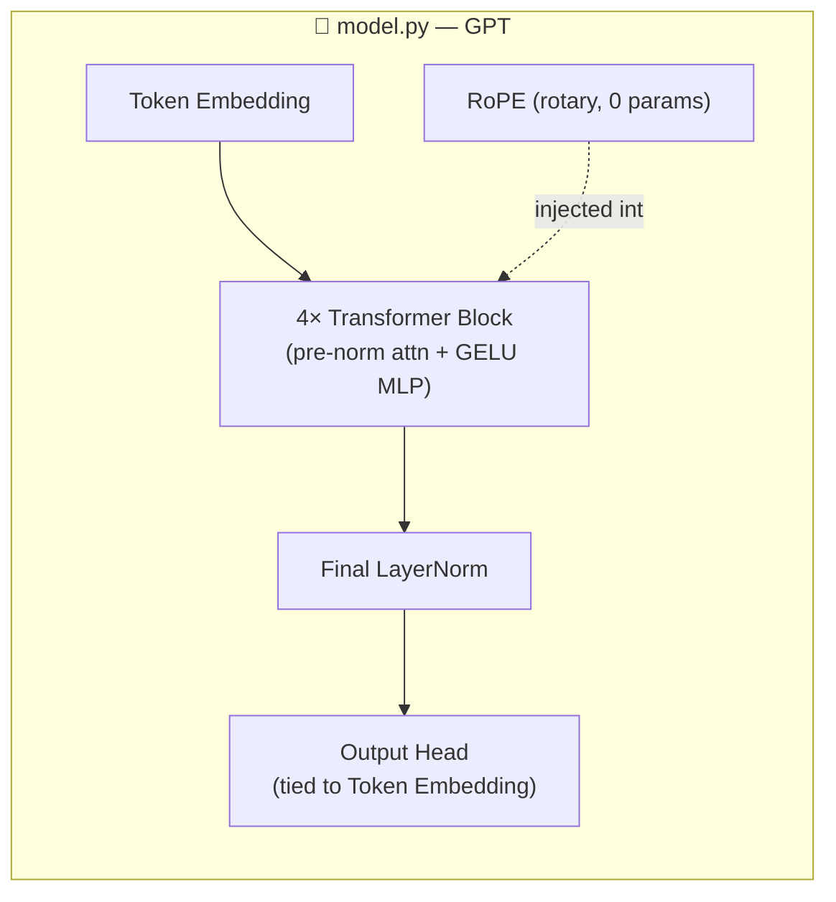
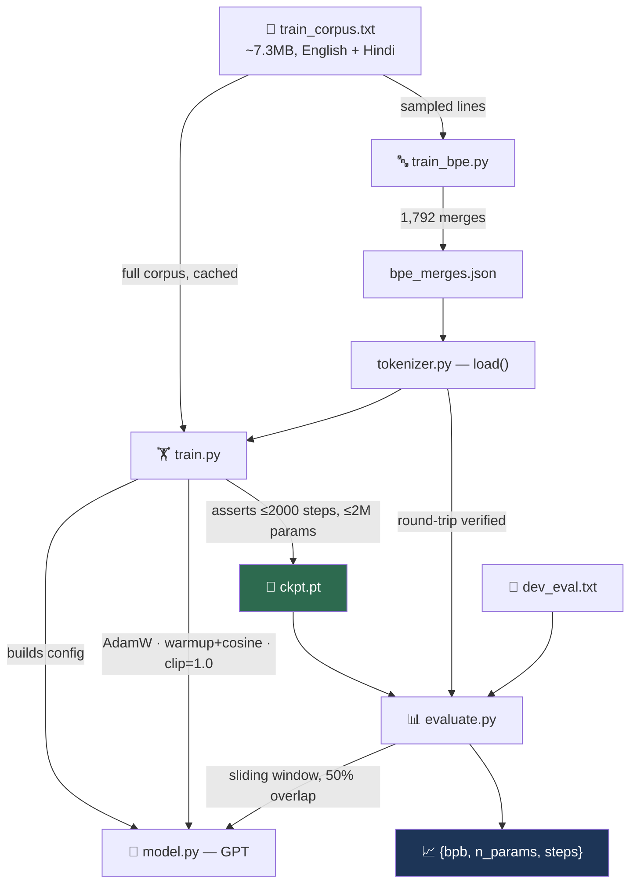
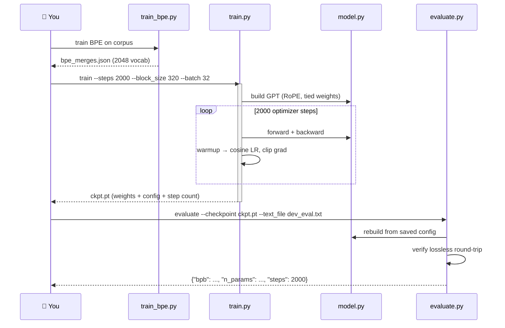

<div align="center">

# 🏁 2,000-Step LLM Speedrun

### *A GPT trained from absolute zero — no pretrained weights, no shortcuts — under a 2,000-step, 2,000,000-parameter budget.*


**From scratch. From `RUNLOG.md`: dev bpb 2.3718 → 1.8124 across the ablation sweep — full run-by-run evidence below.**

</div>

---

## 🎯 The Mission

Everyone gets the same starting line: a deliberately mediocre GPT, the same corpus, the same clock.

> **2,000 optimizer steps. 2,000,000 parameters. CPU only. One corpus. No pretrained anything.**

You can't train longer. You can't make the model bigger. The only lever is: *make every one of those 2,000 steps count more than the next person's.* This repo is the record of doing exactly that — every experiment, every dead end, every fix, logged in `RUNLOG.md` as it happened.

---

## 📖 Table of Contents

- [The Mission](#-the-mission)
- [What Shipped](#-what-shipped)
- [The Journey — In One Picture](#-the-journey--in-one-picture)
- [Architecture](#-architecture)
- [System Flow](#-system-flow)
- [End-to-End Sequence](#-end-to-end-sequence)
- [The Numbers](#-the-numbers)
- [What Broke, and How It Got Fixed](#-what-broke-and-how-it-got-fixed)
- [Folder Structure](#-folder-structure)
- [Component Breakdown](#-component-breakdown)
- [Setup & Reproduce](#-setup--reproduce)
- [Engineering Decisions](#-engineering-decisions)
- [Known Limitations](#-known-limitations)
- [Credits](#-credits)
- [License](#-license)

---

## ✅ What Shipped

| Deliverable | Status | Where |
|---|---|---|
| Modified training code | ✅ Done | `train.py`, `model.py`, `tokenizer.py`, `train_bpe.py` |
| Unmodified scoring interface | ✅ Verified | `evaluate.py` — untouched, interface intact |
| Run-by-run experiment log | ✅ Done | `RUNLOG.md` — 12 logged runs, hypothesis → result → conclusion each |
| Lossless tokenizer round-trip | ✅ Verified | `_check_tokenizer.py` — full corpus + dev set + adversarial UTF-8 |
| Final configuration locked in | ✅ Done | BPE + RoPE + full recipe fix, see [Architecture](#-architecture) |

---

## 🗺️ The Journey — In One Picture



---

## 🏗️ Architecture

<div align="center">

| Component | Baseline | **Final** |
|---|---|---|
| Tokenizer | Byte-level (vocab 256) | **BPE, vocab 2048** |
| Positional encoding | Learned absolute | **RoPE (zero extra params)** |
| Weight tying | ❌ off | **✅ on** |
| Init | Flat `N(0, 0.05)` | **GPT-2-style, depth-scaled** |
| Optimizer | Adam, constant LR | **AdamW, decoupled weight decay** |
| Schedule | None | **Linear warmup → cosine decay** |
| Gradient clipping | None | **Clip @ 1.0** |
| Block size / batch | 128 / 8 | **320 / 32** |
| Peak LR | 3e-4 | **3e-3** |

</div>



---

## 🔄 System Flow



---

## ⏱️ End-to-End Sequence



---

## 📊 The Numbers

All numbers below are **directly from `RUNLOG.md`** — nothing here is estimated.

**Round 1 — isolating tokenizer, recipe, and positional encoding** *(500-step comparisons)*

| Run | Tokenizer | Recipe | Pos. Encoding | dev bpb |
|---|---|---|---|---|
| Baseline (2000 steps) | byte | old | learned | **2.3718** |
| #1 anchor | byte | old | learned | 2.9294 |
| #2 | byte | **new** | learned | 2.4059 |
| #3 | **BPE** | old | learned | 2.3782 |
| #4 | **BPE** | **new** | learned | 2.2373 |
| #5 | **BPE** | **new** | **RoPE** | **1.8770** |

**Round 2 — sweeping block size, batch size, learning rate** *(500-step comparisons, base = Run 5)*

| Run | block_size | batch | lr | dev bpb |
|---|---|---|---|---|
| #7 | 320 | 24 | 3e-3 | 1.8539 |
| #9 | 256 | 32 | 3e-3 | 1.8343 |
| **#12 (winner)** | **320** | **32** | **3e-3** | **1.8124** |

> 🏆 **Locked-in final recipe:** BPE tokenizer + full training-recipe fix + RoPE + block_size=320 + batch=32 + lr=3e-3, trained for the complete 2,000-step budget. Full reasoning behind every row is in `RUNLOG.md`.

---

## 🐛 What Broke, and How It Got Fixed

The assignment explicitly rewards trying something ambitious, watching it fail, and explaining the fix — so here's that story:

> **The BPE encoder's first version hung on the real corpus.**
> The naive implementation rescanned the *entire* token sequence on every merge — O(n × merges). Fine on a toy string. On the full ~7.3MB corpus, it effectively never finished during a round-trip test.
>
> **Diagnosis:** the complexity was the problem, not the logic.
>
> **Fix:** rewrote the encoder around a doubly-linked list + min-heap of candidate merges, dropping it to O(n log n). It now encodes the full corpus in about a minute, verified lossless on the entire corpus, the dev set, and adversarial UTF-8 (emoji, mixed scripts).

---

## 📂 Folder Structure

```text
D:\speedrun/
├── LLM_assignment.pdf          # The brief: rules, caps, deliverables
├── llm_handout.zip             # Original handout archive
└── llm_handout/
    ├── data/
    │   ├── train_corpus.txt    # ~7.3MB English + Hindi — the only training data
    │   └── dev_eval.txt        # Held-out self-scoring text
    └── starter/
        ├── README.md           # You are here
        ├── RUNLOG.md           # Every run, logged: hypothesis → change → result
        ├── model.py            # GPT: attention, RoPE, weight tying, config
        ├── tokenizer.py        # ByteTokenizer + BPETokenizer, one load() interface
        ├── train_bpe.py        # Trains the BPE merge table
        ├── train.py            # Training loop, hard-cap enforcement
        ├── evaluate.py         # Official scorer — interface untouched
        ├── _check_tokenizer.py # Lossless round-trip verifier
        ├── ablate.sh            # Ablation round 1 (Runs 1–5)
        └── ablate2.sh           # Ablation round 2 (Runs 6–12)
```

---

## 🧩 Component Breakdown

<details>
<summary><strong>model.py</strong> — the GPT itself</summary>

Token embedding → optional RoPE or learned positional embedding → 4× pre-norm transformer blocks (causal self-attention + GELU MLP, residual connections) → final LayerNorm → output head (optionally tied to the token embedding). Every architectural knob lives on `Config` — no code changes needed to sweep configs.
</details>

<details>
<summary><strong>tokenizer.py</strong> — one interface, two implementations</summary>

`load()` returns `ByteTokenizer` (raw UTF-8 bytes, vocab 256) or `BPETokenizer` (trained merges, vocab 2048), whichever is available. Both guarantee `decode(encode(text)) == text` exactly, with a byte fallback for anything unseen — required by the grading interface.
</details>

<details>
<summary><strong>train_bpe.py</strong> — tokenizer training</summary>

Learns byte-pair merges from a sampled slice of the corpus using vectorized NumPy pair-counting, so ~1,800 merges finish in minutes instead of hours.
</details>

<details>
<summary><strong>train.py</strong> — the training loop</summary>

AdamW with decoupled weight decay, linear warmup → cosine decay, gradient-norm clipping, full CLI control of every architecture/recipe knob, tokenization caching, and hard assertions on step count and parameter count before saving `ckpt.pt`.
</details>

<details>
<summary><strong>evaluate.py</strong> — the official scorer (unmodified)</summary>

Computes bits-per-byte via a sliding window with 50% context carry-over, verifying tokenizer losslessness before scoring. This file's CLI and output format were never touched.
</details>

---

## 🚀 Setup & Reproduce

```bash
# 1. environment
python3 -m venv env
source env/bin/activate            # Windows: env\Scripts\activate
pip install torch --index-url https://download.pytorch.org/whl/cpu
pip install numpy

# 2. train the tokenizer (only needed once)
python train_bpe.py --data ../data/train_corpus.txt --out bpe_merges.json

# 3. train the model — final locked-in config
python train.py --data ../data/train_corpus.txt --steps 2000 \
    --block_size 320 --batch 32 --lr 3e-3 --pos_encoding rope \
    --tie_weights --out ckpt.pt

# 4. score it — exact grading interface
python evaluate.py --checkpoint ckpt.pt --text_file ../data/dev_eval.txt
```

---

## 🧠 Engineering Decisions

| Decision | Why |
|---|---|
| **BPE over raw bytes** | Devanagari characters cost 2–3 raw bytes each; BPE collapses common sequences into single tokens, buying more real context per step for the Hindi portion of the corpus. |
| **RoPE over learned position embeddings** | Zero learned parameters — with only 2,000 steps, a learned position table has to learn every row from scratch; RoPE has nothing positional left to learn, so all gradient signal goes to content. |
| **Bigger block size & batch, not more steps** | Only *optimizer steps* are capped, not wall-clock or tokens seen — so trading step-time for more tokens-per-step is a legitimate, and effective, way to spend the budget. |
| **Weight tying** | Reclaims ~41K parameters otherwise spent on a redundant output projection, in a budget where every parameter counts. |
| **AdamW + warmup + cosine + clip** | The baseline's constant LR / no-decay / no-clip combination was leaving real, measurable performance on the table — confirmed as an 18% relative bpb drop in isolation. |

Full reasoning, including runs that made things *worse*, is in `RUNLOG.md` — every entry has a hypothesis, the exact change, the before/after number, and a conclusion.

---

## ⚠️ Known Limitations

- Ablation-round numbers above are from **500-step comparisons**, used deliberately to compare configs quickly; the final submission run uses the full 2,000-step budget, which is expected to score better than any of the 500-step rows shown.
- No `requirements.txt` is committed — dependencies are inferred from source imports (`torch`, `numpy`, stdlib only).
- No CI/CD, Docker, or deployment tooling exists — this is a local CLI training/evaluation exercise, not a service.

---

## 🙌 Credits

Built for the *2,000-Step LLM Speedrun* assignment. AI coding assistance (Claude Code) was used throughout, per the assignment's explicit rules — grading weight is on the reasoning in `RUNLOG.md`, not just the final score.

## 📄 License

No license file present in this repository.

